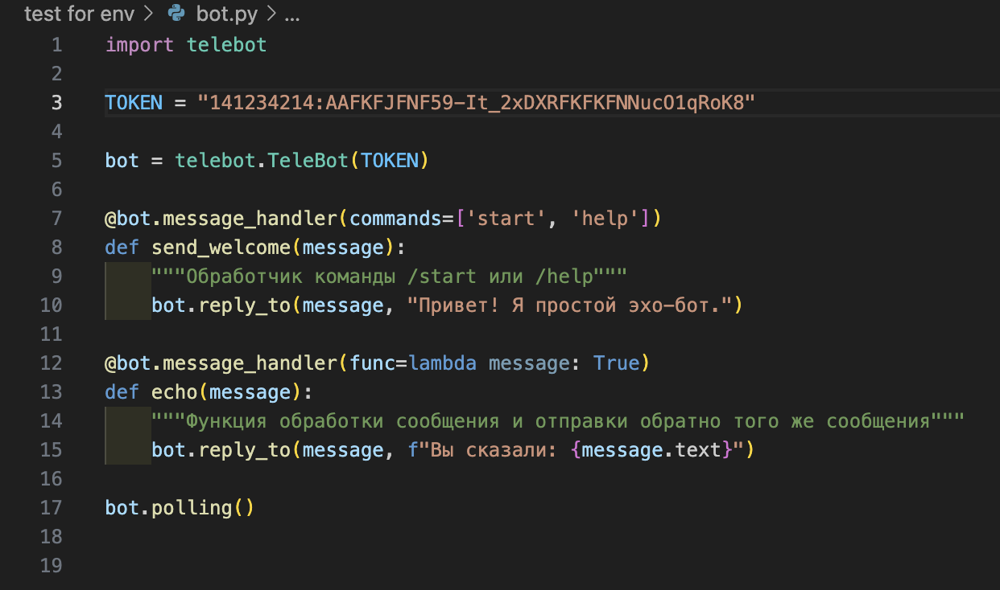
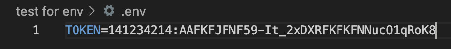
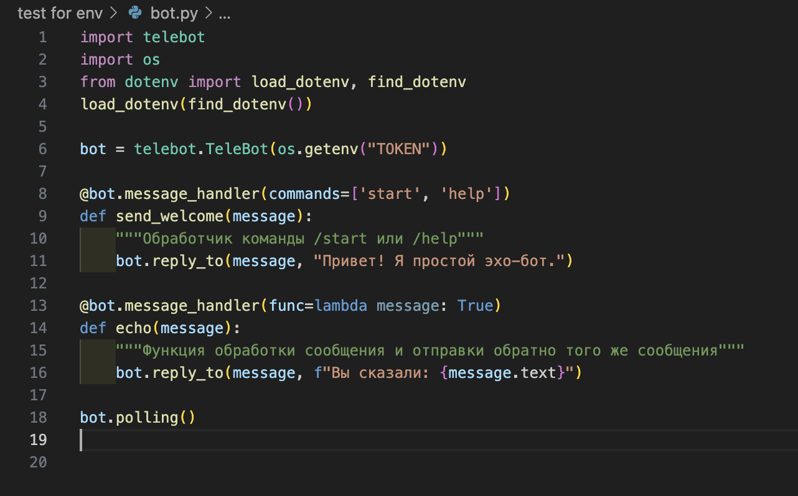
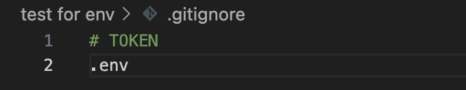

# Для новичков деплоя.

Вот вы написали первое приложение, хочется его задеплоить и хвастаться друзьям и работодателям.
Но в чем проблема, не хочется публиковать в открытом доступе свои Токены API. Моим первым шагом было создание файла config и импортировать его далее, но приходилось, колхозно, пушить в приватный репозиторий версию для деплоя и в открытий репозиторий версию для интересующихся, без файла config. 

Со временем становится понятно, что это не серьезно. Вот и приходит к нам файл .env в котором так же хранятся строки с нашими токенами. Только импортируется теперь os

### На примере простого эхобота на python.



### Пример выноса токена в .env.
Первым шагом будет создание файла .env и запись в него нашего токена \


Дале устанавливаем модуль dotenv 
```bash 
pip install python-dotenv
```

Импортируем os и load_dotenv c find_dotenv, вызываем load_dotenv.\
О find_dotenv вконце, пока это не важно.
```py
import os
from dotenv import load_dotenv, find_dotenv
load_dotenv(find_dotenv())

bot = telebot.TeleBot(os.getenv('TOKEN'))
```

### Пример эхобота с изменениями.



Далее создаем файл .gitignore и вписываем в него .env \
Теперь этот файл будет только на вашем компьютере и не будет пушиться в git репозиторий.\


Все, теперь с легким сердцем можно заливать на githab и начинать показывать работодателю. API токен хранится только у вас и запустить проект можете только вы, локально.
Но как же быть, если хочется похвастаться перед друзьями? Деплоим на удаленный хостинг.
Для примера я возьму полюбившийся мне Amvera, почему? Все просто, молниеносная техподдержка, это круто. Плюс все на русском языке, это приятно.

Заходим, регистрируемся, все интуитивно понятно. Создаем проект


Как обещал, о find_dotenv. Обычно функция используется для обеспечения гибкости в поиске файла .env, особенно когда проекты имеют различную структуру директорий. Она пытается найти файл .env в текущей директории и всех родительских директориях, пока не достигнет корневой директории. Как только файл .env будет найден, его путь будет возвращен функцией, и dotenv загрузит переменные окружения из этого файла.